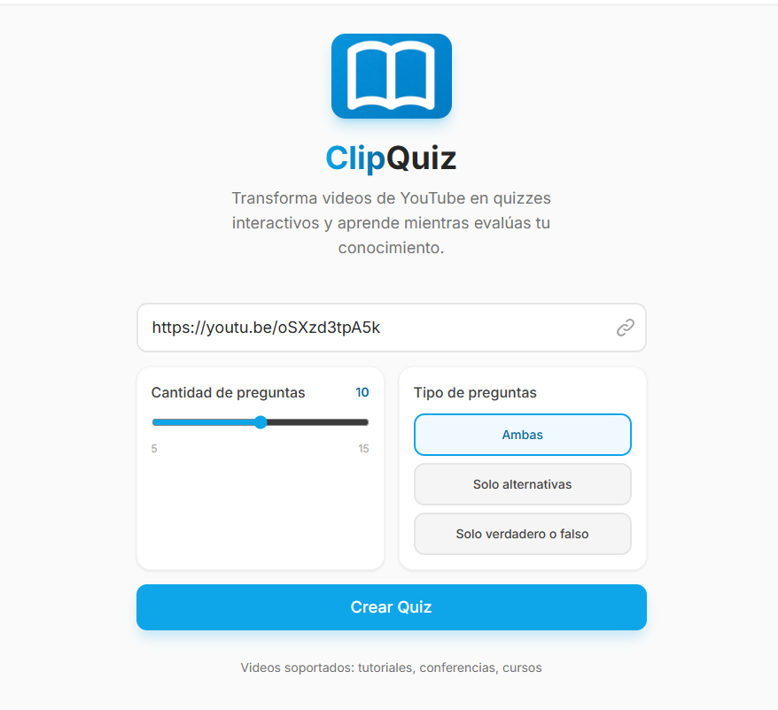
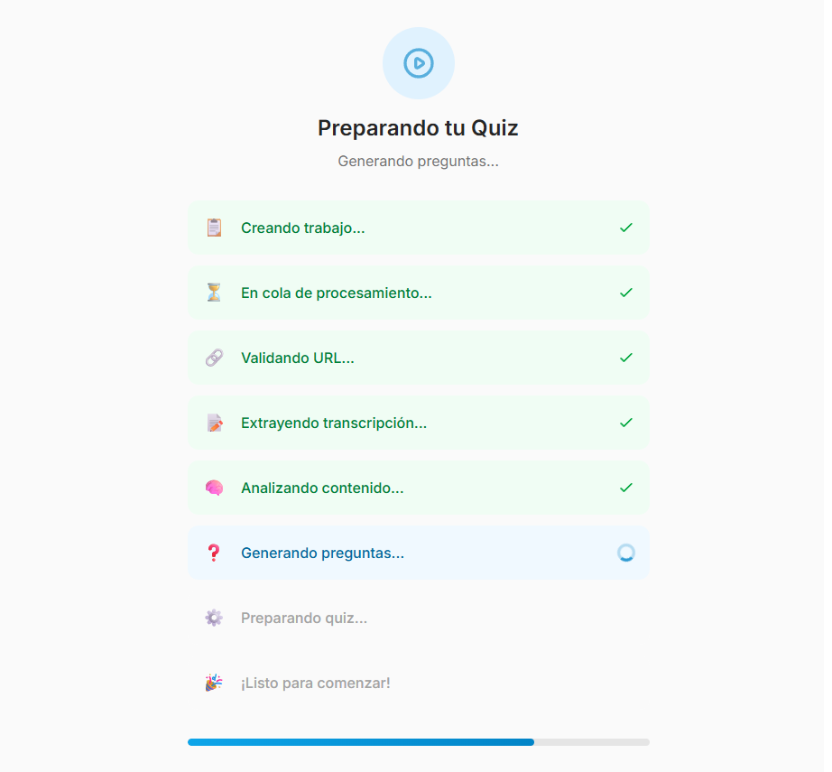
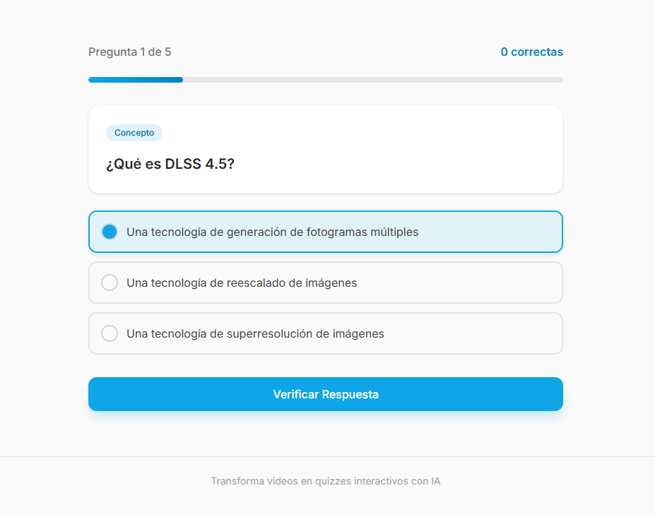
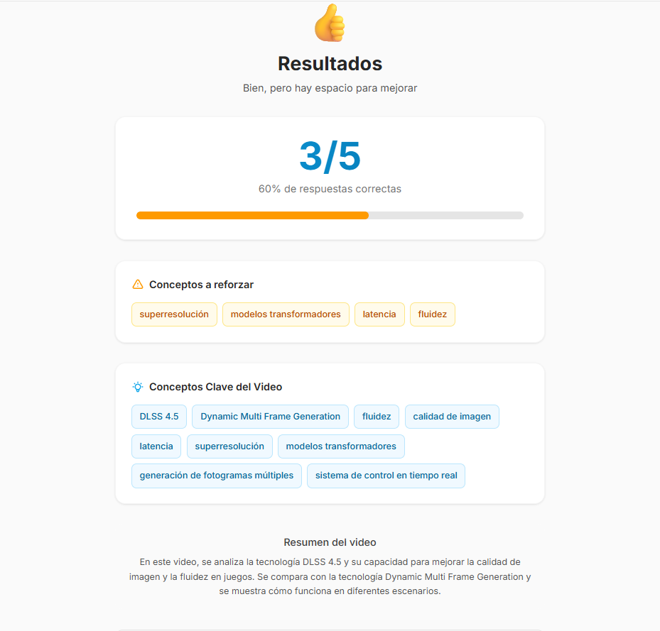

# 🎬 ClipQuiz

**Transforma videos de YouTube en cuestionarios interactivos impulsados por IA**

ClipQuiz es una aplicación full-stack que permite extraer el contenido de videos de YouTube, procesarlo automáticamente y generar cuestionarios inteligentes mediante modelos de lenguaje avanzados. Perfecto para educadores, estudiantes y creadores de contenido que desean crear evaluaciones rápidas y precisas.

---

## 🌟 Características Principales

- ✅ **Procesamiento automático de videos**: Extrae transcripciones de YouTube y las procesa inteligentemente
- 🤖 **Generación de quizzes con IA**: Utiliza modelos gratis de lenguaje de última generación (Cerebras, Groq, OpenRouter)
- 📊 **Múltiples tipos de preguntas**: Opción múltiple de selección, verdadero/falso
- 🎯 **Evaluación interactiva**: Feedback inmediato con pequeñas explicaciones
- ⚡ **Procesamiento asíncrono**: Manejo robusto de jobs en segundo plano
- 🎨 **Interfaz moderna**: Diseño responsive construido con Vue 3 y TypeScript, amigable para poder usar la aplicación sin necesidad de registrarse

---

## 🚀 Demo en Vivo

**Accede aquí**: [ia-quiz-frontend-rnvhxt-dfb75d-144-225-147-77.traefik.me](http://ia-quiz-frontend-rnvhxt-dfb75d-144-225-147-77.traefik.me/)

Lo siento por la URL, no tengo dominio propio.

## URL del repositorio (Público)

**Accede aquí**: [Github](https://github.com/RaixsG/clipquiz)

### Capturas de Pantalla

#### 1. Pantalla de Inicio



*Interfaz limpia para ingresar URLs de YouTube. Validación automática de enlaces.*

---

#### 2. Pantalla de Procesamiento



*Indicador visual del progreso con etapas del procesamiento.*

---

#### 3. Vista del Quiz



*Interfaz interactiva con barra de progreso y navegación entre preguntas.*

---

#### 4. Pantalla de Resultados



*Resumen detallado del desempeño con opción de revisar respuestas incorrectas.*

---

## 🌐 Despliegue en CubePath

### ¿Qué es CubePath?

**[CubePath](https://cubepath.com/)** es un proveedor de infraestructura en la nube

**[Dokploy](https://dokploy.co/)** es una plataforma de deployment moderno que se ejecuta en los servidores de CubePath, simplificando el deployment de aplicaciones full-stack usando Docker y orquestación automática.

### Configuración de ClipQuiz en CubePath

ClipQuiz está desplegado en una instancia **Cloud VPS** en Miami con **Dokploy** como plataforma de deployment. La arquitectura es:

#### 🔧 Infraestructura

```
┌─────────────────────────────────────────────────────┐
│ CubePath (gp.micro instance)                        │
├─────────────────────────────────────────────────────┤
│                                                     │
│  ┌────────────────────────────────────────────┐     │
│  │ - Enrutamiento automático                  │     │
│  └────────────────────────────────────────────┘     │
│           ↓              ↓                          │
│  ┌──────────────┐  ┌──────────────┐                 │
│  │ Frontend     │  │ Backend      │                 │
│  │ (Vue 3)      │  │ (Bun)        │                 │
│  │ :5173        │  │ :3000        │                 |
│  └──────────────┘  └──────────────┘                 │
│                                                     │
└─────────────────────────────────────────────────────┘
```

---

## 📧 Contacto


---

## 🎉 ¡Gracias!

Gracias por usar ClipQuiz. Si te es útil, considera darle una ⭐ al repositorio.

---

**Última actualización**: Marzo 2026
